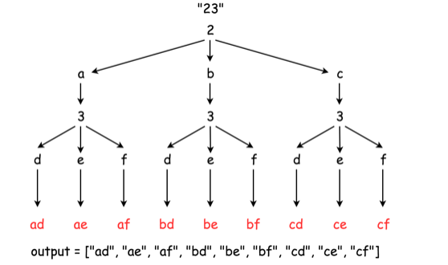

# 17-电话号码的字母组合

> @Author：CSU张扬  
> @Email：csuzhangyang@gmail.com or csuzhangyang@qq.com

Category   | Difficulty | Pass rate| Tags   | Companies
:-:        | :-:        | :-:      | :-:    | :-: |
algorithms | Medium     | 51.27%   | string / backtracking | amazon / dropbox / facebook / google / uber

## 1. 题目

给定一个仅包含数字 `2-9` 的字符串，返回所有它能表示的字母组合。

给出数字到字母的映射如下（与电话按键相同）。注意 `1` 不对应任何字母。


```c
示例:

输入："23"
输出：["ad", "ae", "af", "bd", "be", "bf", "cd", "ce", "cf"].
```

**说明:**  
尽管上面的答案是按字典序排列的，但是你可以任意选择答案输出的顺序。
<!--more-->
来源：力扣（LeetCode）
链接：[https://leetcode-cn.com/problems/letter-combinations-of-a-phone-number/](https://leetcode-cn.com/problems/letter-combinations-of-a-phone-number/)

## 2. 解法

### 2.1 解法一：递归法

以 `digits = "23"`为例：

1. 我们递归函数只接受两个参数：上一次的结果 `res` ，这一次要结合的数字 `digits[i]`。
2. 首先用第一个数字初始化我们的 `res`，例如第一个数字是 `2` ，那么 `res = {"a", "b", "c"}` 。
3. 第二个数字是 `3`，`m[3] = "def"`。那么 `m[3]` 和 `res = {"a", "b", "c"}`怎么组合呢？
4. 首先 `res` 暂时只有3个元素，和 `m[3]` 组合后应该有 $3 \times 3 = 9$ 个元素。
5. 总的来说，元素的添加顺序是，
   1. `res.push_back(res[0] + 'e'); res.push_back(res[0] + 'f');`  
   结果：`res = {"a", "b", "c", "ae", "be", "ce"}`

   1. `res.push_back(res[1] + 'e'); res.push_back(res[1] + 'f');`  
   结果：`res = {"a", "b", "c", "ae", "be", "ce", "af", "bf", "cf"}`

   1. `res[0] += 'd'; res[1] += 'd'; res[2] += 'd';`  
   结果：`res = {"ad", "bd", "cd", "ae", "be", "ce", "af", "bf", "cf"}`
6. 我们得出一个规律，假设当前数字中所含字母长度为 `l`（n=3或4）。我们可以将前 `l-1` 个字母和 `res` 进行排列组合加入到 `res`中。为什么要剩下一个字母呢，因为我们 `res` 中还有一些元素仍然是上次的结果，我们把最后一个字母直接加入到上次的结果的元素后。
7. 当然你也可以选择将所以字母和 `res` 进行排列组合，然后删除前面的无效的元素。

> 执行用时: 4 ms, 在所有 cpp 提交中击败了 77.47% 的用户  
> 内存消耗: 8.4 MB, 在所有 cpp 提交中击败了 90.68% 的用户

```cpp
class Solution {
public:
    string m[10] = {"", "", "abc", "def", "ghi", "jkl", "mno", "pqrs", "tuv", "wxyz"};
    vector<string> letterCombinations(string digits) {
        vector<string> res;
        for (auto i = 0; i < digits.size(); ++ i) {
            combine(res, digits[i]);
        }
        return res;
    }

    void combine(vector<string> &res, char ch) {
        int n = res.size();
        int digit = static_cast<int>(ch) - 48;
        int l = m[digit].size();
        if (n == 0) {
            for (auto j = 0; j < l; ++ j) {
                string s(1, m[digit][j]);
                res.push_back(s);
            }
            return;
        }
        for (auto i = 0; i < n; ++ i) {
            for (auto j = 0; j < l - 1; ++ j)
                res.push_back(res[i] + m[digit][j]);
            res[i] += m[digit][l - 1];
        }
        return;
    }
};
```

### 2.2 解法二：使用队列

1. 每次从队头取出一个元素，与m[]中字符串中的每个字符分别组合，然后放入队尾。

> 执行用时: 0 ms, 在所有 cpp 提交中击败了 100.00% 的用户  
> 内存消耗: 8.7 MB, 在所有 cpp 提交中击败了 48.35% 的用户

```cpp
class Solution {
public:
    vector<string> letterCombinations(string digits) {
        map<char, string> m = { {'2', "abc"}, {'3', "def"}, {'4', "ghi"}, {'5', "jkl"},
                                {'6', "mno"}, {'7', "pqrs"}, {'8', "tuv"}, {'9', "wxyz"} };
        queue<string> q;
        vector<string> res;
        // 先处理第一个数字。是为了使q不为空。
        for (auto i : m[digits[0]]) {
            string s(1, i);
            q.push(s);
        }  
        for (auto i = 1; i < digits.size(); ++ i) {
            int len = q.size();
            for (auto j = 0; j < len; ++ j) {
                string s = q.front();
                for (auto k = 0; k < m[digits[i]].size(); ++ k) {
                    q.push(s + m[digits[i]][k]);
                }
                q.pop();
            }
        }
        while (!q.empty()) {
            res.push_back(q.front());
            q.pop();
        }
    return res;
    }
};
```

### 2.3 深度优先遍历

> 第一段代码来自 [zefengsong](https://leetcode.com/zefengsong/)。  
> 第二份代码是参考 [GQXING](https://leetcode-cn.com/problems/letter-combinations-of-a-phone-number/solution/yan-du-you-xian-bian-li-by-gqxing/) 修改了的第一份代码。  
> 图来自 [LeetCode](https://leetcode-cn.com/problems/letter-combinations-of-a-phone-number/solution/dian-hua-hao-ma-de-zi-mu-zu-he-by-leetcode/)

如图所示。

> 执行用时: 0 ms, 在所有 cpp 提交中击败了 100.00% 的用户  
> 内存消耗: 8.5 MB, 在所有 cpp 提交中击败了 79.75% 的用户

**代码一：** `path` 引用传值。

```cpp
class Solution {
public:
    vector<string> letterCombinations(string digits) {
        vector<string>res;
        if(digits.empty()) return res;
        vector<string>letter({"", "", "abc", "def", "ghi", "jkl", "mno", "pqrs", "tuv", "wxyz"});
        string path = "";
        DFS(digits, 0, path, res, letter);
        return res;
    }

    void DFS(string digits, int pos, string& path, vector<string>& res, vector<string>& letter){
        if(pos == digits.size()){
            res.push_back(path);
            return;
        }
        for(auto c: letter[digits[pos] - '0']){
            path.push_back(c);
            DFS(digits, pos + 1, path, res, letter);
            path.pop_back();
        }
    }
};
```

**代码二：** `path` 非引用传值。

虽然我们知道，在传递字符串时，最好使用引用传值。但是我们的目的是在一次递归里不修改 `path` 的值(否则我们就要像代码1一样，还要删除 `path` 的尾元素)，所以我们不使用引用传值。

```cpp
class Solution {
public:
    vector<string> letterCombinations(string digits) {
        vector<string>res;
        if(digits.empty()) return res;
        vector<string>letter({"", "", "abc", "def", "ghi", "jkl", "mno", "pqrs", "tuv", "wxyz"});
        string path = "";
        DFS(digits, 0, path, res, letter);
        return res;
    }

    void DFS(string digits, int pos, string path, vector<string>& res, vector<string>& letter){
        if(pos == digits.size()){
            res.push_back(path);
            return;
        }
        for(auto c: letter[digits[pos] - '0']){
            DFS(digits, pos + 1, path + c, res, letter);
        }
    }
};
```
