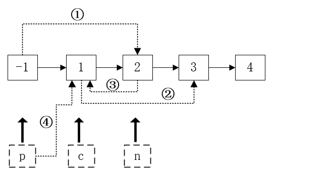
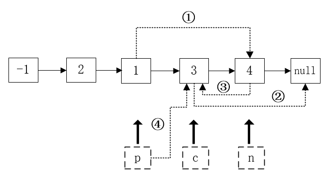

# 24-两两交换链表中的节点

> @Author：CSU张扬  
> @Email：csuzhangyang@gmail.com or csuzhangyang@qq.com

Category   | Difficulty | Pass rate| Tags   | Companies
:-:        | :-:        | :-:      | :-:    | :-: |
algorithms | Medium     | 72.20%   | linked-list  | bloomberg / microsoft / uber

# 1. 题目

给定一个链表，两两交换其中相邻的节点，并返回交换后的链表。

**你不能只是单纯的改变节点内部的值**，而是需要实际的进行节点交换。

```c
示例:
给定 1->2->3->4, 你应该返回 2->1->4->3.
```

来源：力扣（LeetCode）  
链接：[https://leetcode-cn.com/problems/swap-nodes-in-pairs](https://leetcode-cn.com/problems/swap-nodes-in-pairs)

## 2. 解法

### 2.1 解法一：递归解法

我们以 `1 -> 2 -> 3 -> 4 -> 5 -> 6` 为例。  

1. 我们拿出中间两个节点进行分析，例如 `3 -> 4` 。
2. 我们最终要使 `4` 指向 `3` ，上一个节点指向 `4`，`3` 指向下一个节点。  
   即 `上一节点 -> 4 -> 3 -> 下一节点`。
3. 我们对每一对节点都是 **步骤2** 中这样操作的。

**现在有两个问题，递归函数返回什么？怎么使用递归函数的返回值？**

1. 假设我们在某次调用递归时完成了前两个节点的交换，得到了 `4 -> 3` ，这时 结点 `4` 应该返回给上一次递归函数的结果，结点 `3` 应该指向下一次的递归函数的返回值。
2. 然后，传递给递归函数的结点应该向后移动两位。

**递归结束的条件？**
当我们的结点数不足两个时，递归结束。

> 执行用时: 8 ms, 在所有 cpp 提交中击败了49.37%的用户  
> 内存消耗: 8.7 MB, 在所有 cpp 提交中击败了73.37%的用户

```cpp
/**
 * Definition for singly-linked list.
 * struct ListNode {
 *     int val;
 *     ListNode *next;
 *     ListNode(int x) : val(x), next(NULL) {}
 * };
 */
class Solution {
public:
    ListNode* swapPairs(ListNode* head) {
        if (head == nullptr || head->next == nullptr) {
            return head;
        }
        ListNode *next = head->next;
        head->next = swapPairs(next->next);
        next->next = head;
        return next;
    }
};
```

### 2.2 解法二：非递归解法

我们用两个图来描述这个算法的过程。  

- 实线箭头是原来的链表结构，虚线是我们改变之后的。
- ①②③④是我们交换链表的过程顺序。
- 注意，`p` 指针最后会更新（如④所示）。
- 当 `p` 之后的结点数不足两个时，循环结束。




> 执行用时: 8 ms, 在所有 cpp 提交中击败了49.37%的用户  
> 内存消耗: 8.6 MB, 在所有 cpp 提交中击败了79.04%的用户

```cpp
class Solution {
public:
    ListNode* swapPairs(ListNode* head) {
        ListNode *p = new ListNode(-1);
        p->next = head;
        ListNode *h = p;
        while(p->next && p->next->next) {
            ListNode *c = p->next;
            ListNode *n = p->next->next;
            p->next = c->next;
            c->next = n->next;
            n->next = c;
            p = c;
        }
        return h->next;
    }
};
```
